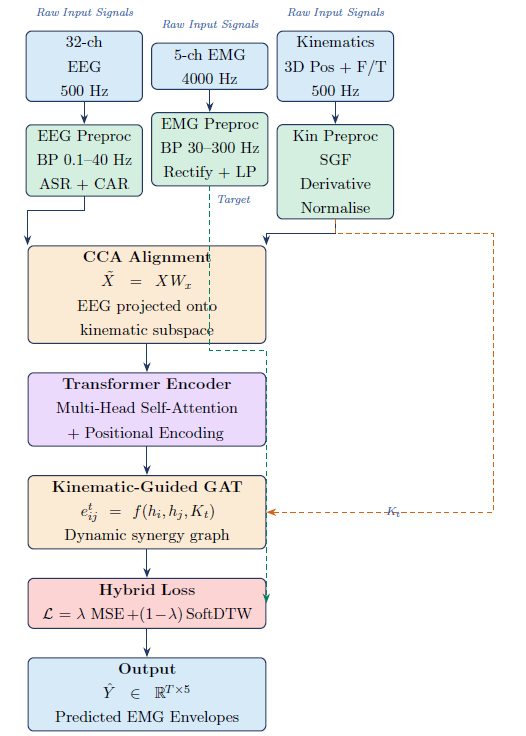
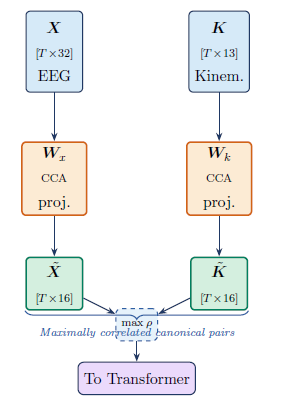
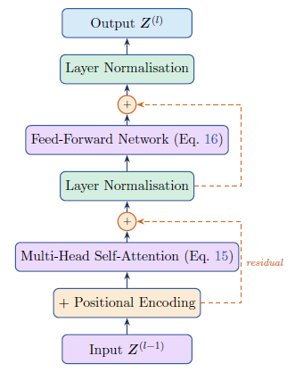
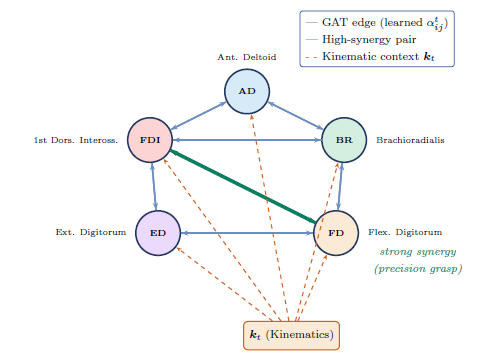
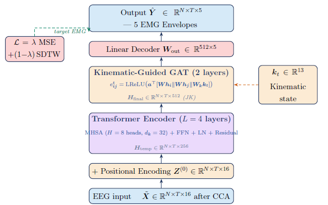

# eeg2emg-kg-gt

**Kinematic-Guided Graph-Transformer for Continuous EMG Envelope Prediction from EEG**

> Method 1 (KG-GT) — Phase 1 implementation  
> Dataset: WAY-EEG-GAL · 12 subjects · 3,936 trials · 32-ch EEG · 5-ch EMG  
> Branch: `KG-GT`

---

## Overview

Predicts continuous EMG envelopes from scalp EEG and kinematic signals during grasp-and-lift tasks. Core motivation: prosthetic control in high-level amputation where functional muscles are absent — EEG is the only viable signal source.

**Architecture:** CCA-aligned EEG → Transformer encoder → Kinematic-Guided GAT → hybrid MSE + SoftDTW loss → 5-channel EMG envelope

**Research gaps addressed (Method 1):**

| Gap | Problem | Solution |
|-----|---------|----------|
| G1 | UKF linear expressivity | Transformer replaces linear state-space model |
| G2 | Single-subject scope | Validated on all 12 subjects, 3,936 trials |
| G3 | Kinematics underutilised | CCA alignment + kinematic conditioning of GAT |
| G4 | No synergy structure in EEG decoding | GAT over 5 EMG nodes with dynamic edge weights |
| G5 | Temporal misalignment (conduction delay) | Hybrid MSE + SoftDTW loss |

---

## Dataset: WAY-EEG-GAL

12 right-handed participants, grasp-and-lift task (thumb + index finger), object lifted ~5 cm.  
Weight: 165 / 330 / 660 g · Surface: sandpaper / suede / silk (randomised).

| Signal | Channels | Fs | Hardware |
|--------|----------|----|----------|
| EEG | 32 (ActiCap) | 500 Hz | International 10-20: Fp1–PO10 |
| EMG | 5 | 4,000 Hz | AD, BR, FD, ED, FDI |
| Kinematics | 4 × 6-DOF | 500 Hz | Polhemus FASTRAK (object, index, thumb, wrist) |
| Force/Torque | 2 × 6-axis | 500 Hz | ATI Nano-17 at both contact plates |

**EMG muscles (5 GAT nodes):**
```
AD  = Anterior Deltoid         (shoulder transport)
BR  = Brachioradialis          (forearm stabilisation)
FD  = Flexor Digitorum         (finger flexion / grip)
ED  = Extensor Digitorum       (finger extension)
FDI = First Dorsal Interosseus (precision pinch)
```

**Data split per participant (9 series + 1 stability):**

```
Series 1–7  →  Train
Series 8    →  Validation
Series 9    →  Test (standard)
Series ST   →  Test (perturbation / stability, held-out)
```

---

## End-to-End Preprocessing Pipeline

<p align="center">
  
</p>
<p align="center"><em>Fig 1. Full preprocessing pipeline for Method 1 (KG-GT). EEG and kinematics are preprocessed in parallel, then jointly aligned via CCA. EMG envelope is extracted as the training target and fed directly to the loss function.</em></p>

### EEG (`src/preprocessing/eeg.py`)

Raw 32-channel EEG at 500 Hz:

1. **Bandpass 0.1–40 Hz** — 4th-order zero-phase Butterworth (`sosfiltfilt`)
2. **Notch 50 Hz** — power-line removal (`iirnotch`)
3. **ASR** — Artifact Subspace Reconstruction: sliding 500 ms window, reject $> 5\sigma$ from clean baseline
4. **CAR** — Common Average Reference: $x_i(t) \mathrel{-}= \frac{1}{C}\sum_j x_j(t)$
5. **Delta extraction** — 0.1–2 Hz bandpass (4th-order zero-phase Butterworth)
6. **Windowing** — $T_w = 500$ samples (1 s), stride $= 50$ samples (100 ms)

Output: $\mathbf{X}_\text{raw} \in \mathbb{R}^{N \times 500 \times 32}$

### EMG (`src/preprocessing/emg.py`)

Raw 5-channel EMG at 4,000 Hz:

1. **Bandpass 30–300 Hz** — 4th-order Butterworth at 4000 Hz
2. **Full-wave rectification** — $|s(t)|$
3. **Low-pass 10 Hz** — smooth activation envelope
4. **Decimate ×8** — $4000 \to 500$ Hz (`scipy.signal.decimate`)
5. **Z-score normalisation** — per channel, statistics fit on train set only

Output: $\mathbf{Y} \in \mathbb{R}^{N \times 500 \times 5}$ ← training target

### Kinematics (`src/preprocessing/kinematics.py`)

Kinematic state vector $\mathbf{k}_t \in \mathbb{R}^{13}$ at each time step:

$$\mathbf{k}_t = \bigl[\,\mathbf{p}_\text{wrist},\; \mathbf{p}_\text{index},\; \mathbf{p}_\text{thumb},\; d_\text{grip},\; F_L,\; F_G,\; \rho_{GL}\,\bigr]^\top$$

where $\mathbf{p} \in \mathbb{R}^3$ are 3D positions, $d_\text{grip} = \|\mathbf{p}_\text{index} - \mathbf{p}_\text{thumb}\|_2$ is grip aperture, $F_L$ and $F_G$ are load and grip forces, and $\rho_{GL} = F_G / F_L$.

Velocity derived via Savitzky-Golay filter (window = 11, poly = 3). Per-feature normalisation using train statistics.

Output: $\mathbf{K} \in \mathbb{R}^{N \times 500 \times 13}$

---

## CCA-Based EEG–Kinematic Alignment

<p align="center">
  
</p>
<p align="center"><em>Fig 2. CCA alignment stage. EEG matrix X [T×32] and kinematic matrix K [T×13] are projected via learned matrices W_x and W_k that maximise canonical correlation ρ. Only X̃ propagates to the Transformer; K̃ serves as alignment target during training.</em></p>

Canonical Correlation Analysis finds projection matrices $\mathbf{W}_x \in \mathbb{R}^{32 \times 16}$ and $\mathbf{W}_k \in \mathbb{R}^{13 \times 16}$ solving:

$$\max_{\mathbf{W}_x,\,\mathbf{W}_k} \quad \rho = \frac{\mathbf{W}_x^\top \boldsymbol{\Sigma}_{xk}\,\mathbf{W}_k} {\sqrt{\mathbf{W}_x^\top \boldsymbol{\Sigma}_{xx}\,\mathbf{W}_x}\;\sqrt{\mathbf{W}_k^\top \boldsymbol{\Sigma}_{kk}\,\mathbf{W}_k}}$$

EEG is then projected onto the kinematic subspace:

$$\tilde{\mathbf{X}} = \mathbf{X}\,\mathbf{W}_x, \qquad \tilde{\mathbf{X}} \in \mathbb{R}^{T \times 16}$$

Solved via generalised eigenvalue decomposition (training-set covariances only).

```
EEG  X [T×32] ──► W_x ──► X̃ [T×16] ──┐
                                        ├─ max ρ ──► To Transformer
Kin  K [T×13] ──► W_k ──► K̃ [T×16] ──┘
```

- Reduces 32 EEG channels to $d = 16$ canonical components
- Biomechanical prior knowledge encoded into feature space
- $\mathbf{W}_x$ saved per participant; applied at inference without $\mathbf{K}$

Implementation: `sklearn.cross_decomposition.CCA(n_components=16)`

---

## Transformer Encoder

<p align="center">
  
</p>
<p align="center"><em>Fig 3. One Transformer encoder layer. Residual (skip) connections preserve low-level temporal features across depth. Four such layers are stacked (L=4).</em></p>

Sinusoidal positional encoding added to CCA output:

$$\text{PE}_{(p,\,2i)} = \sin\!\left(\frac{p}{10000^{2i/d}}\right), \qquad \text{PE}_{(p,\,2i+1)} = \cos\!\left(\frac{p}{10000^{2i/d}}\right)$$

$$\mathbf{Z}^{(0)} = \tilde{\mathbf{X}} + \mathbf{PE}$$

Each of $L = 4$ stacked layers applies Multi-Head Self-Attention (MHSA) and a Feed-Forward Network (FFN):

$$\mathbf{Q}_i = \mathbf{Z}^{(l-1)}\mathbf{W}_{Q_i}, \quad \mathbf{K}_i = \mathbf{Z}^{(l-1)}\mathbf{W}_{K_i}, \quad \mathbf{V}_i = \mathbf{Z}^{(l-1)}\mathbf{W}_{V_i}$$

$$\text{head}_i = \text{softmax}\!\left(\frac{\mathbf{Q}_i \mathbf{K}_i^\top}{\sqrt{d_k}}\right)\mathbf{V}_i$$

$$\text{MHSA}(\mathbf{Z}) = \text{Concat}(\text{head}_1, \ldots, \text{head}_H)\,\mathbf{W}_O$$

$$\text{FFN}(\mathbf{x}) = \max(0,\, \mathbf{x}\mathbf{W}_1 + \mathbf{b}_1)\,\mathbf{W}_2 + \mathbf{b}_2$$

With residual connections and layer normalisation:

$$\mathbf{Z}'^{(l)} = \text{LN}\!\left(\mathbf{Z}^{(l-1)} + \text{MHSA}(\mathbf{Z}^{(l-1)})\right)$$

$$\mathbf{Z}^{(l)} = \text{LN}\!\left(\mathbf{Z}'^{(l)} + \text{FFN}(\mathbf{Z}'^{(l)})\right)$$

Output: $\mathbf{H}_\text{temp} = \mathbf{Z}^{(L)} \in \mathbb{R}^{N \times 500 \times 256}$

Models nonlinear multi-lag temporal coupling within the physiological delay range (5–25 samples at 500 Hz = 10–50 ms).

---

## Kinematic-Guided Graph Attention Network (KG-GAT)

<p align="center">
  
</p>
<p align="center"><em>Fig 4. Kinematic-Guided GAT over the five WAY-EEG-GAL EMG channels. Edge weights α_ij^t are dynamically recomputed at every time step from kinematic state k_t, enabling task-phase-dependent muscle synergy modelling. Thick green edge = strong FD↔FDI synergy during precision grasp loading phase.</em></p>

Graph $G = (V, E)$: **5 nodes** (one per EMG channel), fully connected edges encoding potential muscle synergy.

**Key innovation:** attention coefficients conditioned on $\mathbf{k}_t$ at every timestep — inter-muscle relationships change dynamically with task phase:

$$e_{ij}^t = \text{LeakyReLU}\!\left(\mathbf{a}^\top\!\bigl[\mathbf{W}\mathbf{h}_i \;\|\; \mathbf{W}\mathbf{h}_j \;\|\; \mathbf{W}_k\mathbf{k}_t\bigr]\right)$$

$$\alpha_{ij}^t = \frac{\exp(e_{ij}^t)}{\displaystyle\sum_{n \in \mathcal{N}_i} \exp(e_{in}^t)}$$

$$\mathbf{h}_i^{(l+1)} = \sigma\!\left(\sum_{j \in \mathcal{N}_i} \alpha_{ij}^t\,\mathbf{W}\mathbf{h}_j^{(l)}\right)$$

**Jumping Knowledge (JK) aggregation** across both GAT layers:

$$\mathbf{h}_i^\text{final} = \text{Concat}\!\left(\mathbf{h}_i^{(1)},\, \mathbf{h}_i^{(2)}\right) \in \mathbb{R}^{512}$$

**Linear decoder:**

$$\hat{\mathbf{Y}} = \mathbf{H}_\text{final}\,\mathbf{W}_\text{out} + \mathbf{b}_\text{out}, \qquad \hat{\mathbf{Y}} \in \mathbb{R}^{T \times 5}$$

---

## Full Model Architecture

<p align="center">
  
</p>
<p align="center"><em>Fig 5. Complete KG-GT architecture (Method 1). Tensor dimensions shown at each stage. Dashed orange arrow = kinematic state k_t injected into the GAT at inference time. Dashed green arrow = EMG envelope used as training target in the hybrid loss.</em></p>

```
EEG input  X̃ ∈ R^{N × 500 × 16}   (after CCA)
    │
    ▼
+ Positional Encoding   Z^(0) ∈ R^{N × 500 × 16}
    │
    ▼
Transformer Encoder  (L=4, H=8, d_k=32, d_model=256)
    │
    ▼  H_temp ∈ R^{N × 500 × 256}
    │                           ▲
    ▼                           │  k_t ∈ R^{13}
KG-GAT (2 layers, JK concat) ◄─┘
    │
    ▼  H_final ∈ R^{N × 500 × 512}
    │
    ▼
Linear Decoder  W_out ∈ R^{512 × 5}
    │
    ▼
Ŷ ∈ R^{N × 500 × 5}   ← 5 predicted EMG envelopes
    │
    ▼
Hybrid Loss  L = 0.9·MSE + 0.1·SoftDTW(γ=0.1)  ◄── Y (target EMG)
```

---

## Hybrid Loss Function

Tolerates cortico-muscular conduction delay (~10–30 ms) during training:

$$\mathcal{L}_\text{total} = \lambda\,\text{MSE}(\mathbf{Y}, \hat{\mathbf{Y}}) + (1-\lambda)\,\text{SoftDTW}_\gamma(\mathbf{Y}, \hat{\mathbf{Y}})$$

$$\text{MSE}(\mathbf{Y}, \hat{\mathbf{Y}}) = \frac{1}{TM}\sum_{t=1}^{T}\sum_{m=1}^{M}\bigl(y_{t,m} - \hat{y}_{t,m}\bigr)^2$$

$$\text{SoftDTW}_\gamma(\mathbf{Y}, \hat{\mathbf{Y}}) = \min_\pi^\gamma \langle \mathbf{D}(\mathbf{Y}, \hat{\mathbf{Y}}),\, \mathbf{A}(\pi) \rangle$$

where the smooth minimum operator is:

$$\min^\gamma(a_1, \ldots, a_n) = -\gamma \log \sum_{i=1}^{n} \exp\!\left(-\frac{a_i}{\gamma}\right)$$

- $\lambda = 0.9$ (initial; tuned on validation set)
- $\gamma = 0.1$ — as $\gamma \to 0$ recovers hard DTW; $\gamma \to \infty$ recovers MSE
- SoftDTW is differentiable via the smooth minimum operator (Cuturi & Blondel, 2017)

---

## Training Protocol

| Hyperparameter | Value |
|---|---|
| Optimizer | Adam |
| Learning rate | $10^{-3}$ |
| LR schedule | $\times 0.5$ every 50 epochs without val improvement |
| Batch size | 32 |
| Early stopping patience | 30 epochs |
| Dropout | 0.2 |
| Gradient clipping | norm = 1.0 |
| Loss $\lambda$ | 0.9 (MSE weight) |
| SoftDTW $\gamma$ | 0.1 |
| CCA components $d$ | 16 |
| Transformer layers $L$ | 4 |
| Attention heads $H$ | 8 |
| $d_\text{model}$ | 256 |
| FFN dim | 1024 |
| GAT layers | 2 |
| GAT output (JK) | 512 |
| Window $T_w$ | 500 samples (1 s) |
| Stride | 50 samples (100 ms) |
| Cross-validation | LOSOCV (leave-one-subject-out) |
| Total parameters | ~2M |

---

## Evaluation Metrics

All metrics computed per EMG channel $m$, averaged across 12 subjects. $R_m$ = signal range of channel $m$.

$$\text{nRMSE}_m = \frac{1}{R_m}\sqrt{\frac{1}{T}\sum_{t=1}^{T}(y_{t,m} - \hat{y}_{t,m})^2}$$

$$\text{nMAE}_m = \frac{1}{T\,R_m}\sum_{t=1}^{T}\left|y_{t,m} - \hat{y}_{t,m}\right|$$

$$r_m = \frac{\text{Cov}(Y_m,\,\hat{Y}_m)}{\sqrt{\text{Var}(Y_m)\,\text{Var}(\hat{Y}_m)}}$$

$$R^2_m = 1 - \frac{\displaystyle\sum_{t}(y_{t,m} - \hat{y}_{t,m})^2}{\displaystyle\sum_{t}(y_{t,m} - \bar{y}_m)^2}$$

$$\text{SNR}_m = 10\log_{10}\!\left[\frac{\text{Var}(Y_m)}{\text{MSE}(Y_m,\,\hat{Y}_m)}\right] \quad \text{(dB)}$$

---

## Expected Performance

| Method | Input | Expected $r$ | Expected $R^2$ | Params | Multi-task |
|---|---|---|---|---|---|
| UKF (Sburlea 2021) | EEG delta | ~0.20 | — | minimal | No |
| CNN-LSTM (Jain 2025) | EEG | ~0.50 | ~0.35 | ~500K | No |
| **KG-GT (M1, ours)** | EEG + Kin | **>0.55** | **>0.45** | ~2M | No |
| NNMF-KG-GT (M2) | EEG + Kin + NNMF | >0.60 | >0.50 | ~2M | No |
| PTL-Net (M3) | 6-ch EEG (phase) | >0.65 | >0.55 | ~300K | Yes |
| USPT (M4) | 6-ch EEG + Kin + NNMF | >0.75 | >0.65 | ~1.5M | Yes |

---

## Project Structure

```
eeg2emg-kg-gt/
├── .gitignore
├── README.md
├── requirements.txt
├── docs/
│   └── figures/
│       ├── kg-gt-preprocess.png
│       ├── kg-gt-cca.png
│       ├── kg-gt-transformer.png
│       ├── kg-gt-GAT.png
│       └── kg-gt-full-model.png
├── configs/
│   └── default.yaml
├── notebooks/
│   └── 01_explore.ipynb
└── src/
    ├── data/
    │   ├── loader.py          # scipy.io.loadmat → raw numpy arrays
    │   └── dataset.py         # PyTorch Dataset, windowing, split logic
    ├── preprocessing/
    │   ├── eeg.py             # BP → notch → ASR → CAR → delta → window
    │   ├── emg.py             # BP → rectify → LP → decimate → z-score
    │   ├── kinematics.py      # SGF derivative, build k_t (13-dim)
    │   └── cca.py             # fit CCA, project X → X̃ (32→16)
    ├── models/
    │   ├── transformer.py     # L=4, H=8, d_model=256 encoder
    │   ├── kg_gat.py          # KG-GAT 2 layers + JK concat → 512
    │   └── kg_gt.py           # full model: CCA + Trans + GAT + Decoder
    ├── losses/
    │   └── soft_dtw.py        # SoftDTW γ=0.1 + hybrid λ=0.9 MSE blend
    └── training/
        ├── train.py           # Adam, scheduler, early stop, grad clip, LOSOCV
        └── evaluate.py        # nRMSE, nMAE, r, R², SNR per channel
```

---

## Installation

```bash
git clone https://github.com/<YOUR_USERNAME>/eeg2emg-kg-gt.git
cd eeg2emg-kg-gt
git checkout KG-GT

python -m venv .venv
source .venv/bin/activate        # Windows: .venv\Scripts\activate
pip install -r requirements.txt
```

---

## Data Setup

Download WAY-EEG-GAL from PhysioNet / Scientific Data (Luciw et al., 2014).  
Unzip each `PX.zip` into `data/way-eeg/raw/PX/`:

```
data/way-eeg/raw/
├── P1/
│   ├── HS_P1_S1.mat   ← standard series (S1–S9)
│   ├── WS_P1_S1.mat   ← weighted series
│   └── HS_P1_ST.mat   ← stability/perturbation series
├── P2/ ... P12/
```

`data/` is `.gitignore`d — never committed.

---

## Usage

```bash
# Preprocess all participants
python src/preprocessing/run_all.py --config configs/default.yaml

# Train single subject
python src/training/train.py --subject P1 --config configs/default.yaml

# Leave-one-subject-out cross-validation
python src/training/train.py --losocv --config configs/default.yaml

# Evaluate checkpoint
python src/training/evaluate.py --checkpoint checkpoints/best_P1.pt --subject P1
```

---

## References

```
[1] M. D. Luciw, E. Jarocka, B. B. Edin,
    "Multi-channel EEG recordings during 3,936 grasp and lift trials
    with varying weight and friction," Scientific Data, 2014.

[2] A. I. Sburlea, N. Butturini, G. R. Müller-Putz,
    "Predicting EMG envelopes of grasping movements from EEG recordings
    using Unscented Kalman Filtering," 2021.

[3] P. Jain et al.,
    "EEG-Based Surface EMG Reconstruction Using Deep Sequence Learning
    for Upper Limb Motor Activity," 2025.

[4] M. Cuturi, M. Blondel,
    "Soft-DTW: A differentiable loss function for time-series," ICML, 2017.

[5] P. Veličković et al., "Graph Attention Networks," ICLR, 2018.

[6] A. Vaswani et al., "Attention is all you need," NeurIPS, 2017.
```

---

## Author

**MohammadMahdi SharifBeigi** — Computational Neuroscience Team 6, 2025  
Contact: sharifbeigymohammad@gmail.com
